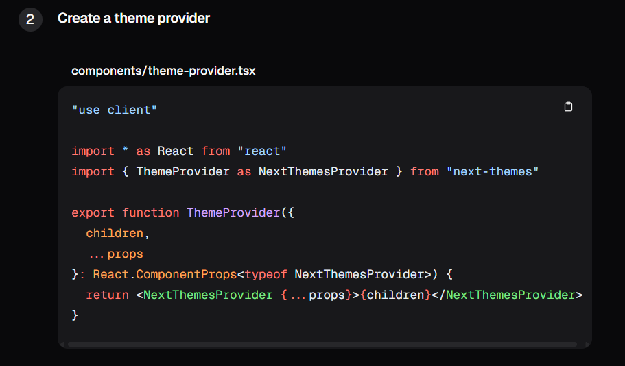

# Step 1 (Create Project)
#### Create Folder --> Terminal --> npx create-next-app@latest

(npx create-next-app@latest is used to create a new Next.js project using the latest version of the Next.js starter template.)

```
√ What is your project named? ... .
√ Would you like to use TypeScript? -- No❌
√ Would you like to use ESLint? -- Yes✅
√ Would you like to use Tailwind CSS? -- Yes✅
√ Would you like your code inside a src/ directory? -- No❌
√ Would you like to use App Router? (recommended) -- Yes✅
√ Would you like to use Turbopack for next dev? -- yes✅
√ Would you like to customize the import alias (@/* by default)? -- No❌
Creating a new Next.js app in C:\Documents\FolderName
```
## i. Run command 
- Path -> cd C:\Documents\FolderName
- npm run dev
## ii. Documentation
https://nextjs.org/docs?utm_source=create-next-app&utm_medium=appdir-template-tw&utm_campaign=create-next-app
#### Learn Next.js
https://nextjs.org/learn?utm_source=create-next-app&utm_medium=appdir-template-tw&utm_campaign=create-next-app

# Shadcn ui 

https://ui.shadcn.com/

About: shadcn/ui is a modern, headless, and customizable UI component library built for React + Tailwind CSS, especially popular in Next.js apps.

Shadcn --> Docs --> Installation --> Next.js --> Under create project --> Select npm --> Copy command
```
npx shadcn@latest init
```
 Paste in terminal --> In teminal after run command -> choose "Neutral" -> How would you like to proceed? --> Use --legacy-peer-deps✅.
- ✔ Installing dependencies.
  - ✔ Created 1 file:
  - lib\utils.js

## Install some components from Shadcn ui
i. Button 
- left side bar scroll and select "Button".
- npm installation command 
```
npx shadcn@latest add button
```
Copy and paste it in terminal.
- ✔ Installing dependencies.
  - ✔ Created 1 file:
  - components\ui\button.jsx

 ii. Accordion
  - left side bar scroll and select "Accordion".
  - Paste this command in terminal 
  ```
  npx shadcn@latest add accordion badge alert-dialog card dialog dropdown-menu input label progress radio-group select sonner tabs textarea
  ```
  - How would you like to proceed? 
    - select -> Use --legacy-peer-deps.
  - ✔ Installed dependencies.
- ✔ Created 13 files:
    - components\ui\badge.jsx
    - components\ui\alert-dialog.jsx
    - components\ui\card.jsx
    - components\ui\dialog.jsx
    - components\ui\dropdown-menu.jsx
    - components\ui\input.jsx
    - components\ui\label.jsx
    - components\ui\progress.jsx
    - components\ui\radio-group.jsx
    - components\ui\select.jsx
    - components\ui\sonner.jsx
    - components\ui\tabs.jsx
    - components\ui\textarea.jsx

iii. Dark mode
  - left side bar scroll and select "Dark Mode".
  - Paste this command in terminal.
  ```
  npm install next-themes
```
- Create new file in the folder Components named the file "theme-provider.jsx" and copy this code 
and paste it in file.